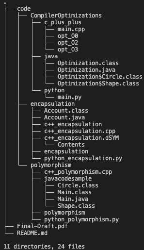

# CSCI 5448-001 - Object Oriented Analysis and Design - Graduate Research Project

## Project Details

Paper Title - Object-Oriented Performance Tuning: Comparing JVM, CPython, and C++

Authors - Chetan Badiger, Prajwal Kiran Naik

Abstract - This work aims to compare how the internal object models of 
different languages influence the speed of the application, 
memory and the responsiveness to user input. This paper 
aims to examine three popular environments – JVM, CPython, and native C++ - and analyze how they represent objects in memory. This paper will explore aspects such as virtual tables and garbage collection versus memory management. Prior work highlights the substantial cost of virtual dispatch in C++ (Driesen et, al. 1995), object-centric memory 
inefficiencies in managed languages, and orders-of-magnitude slowdowns in Python relative to C++ due to interpreter 
overhead (Saqib et. al. 2021). By comparing these runtimes, 
the paper emphasizes how OO principles such as encapsulation and polymorphism are implemented differently across 
different compilers and how these differences affect CPU cycles, cache locality, and runtime optimizations.

## Repository Details
The project is organized as follows -

The `code` directory contains all the code used in the paper. This directory contains the following structure.
- `encapsulation`: contains the code for comparing execution times and memory usage for codes with encapsulation.
- `polymorphism` : contains the code for comparing execution times and memory usage for codes with polymorphism.
- `CompilerOptimizations`: contains the code for comparing the execution times for object codes compiled with different compiler optimization flags.

## Code Execution Instructions
All C++ codes are to be compiled using the following command -
`g++ <filename> -o <objectfile>`

The code files in the `CompilerOptimization/c_plus_plus` and `CompilerOptimization/java` and directory require special compiler flags.
- To compile a C++ file with -O0, -O2, -O3 compiler optimization, use `g++ <filename> -o <objectfile> -O0 | -O2 | -O3`. Change the flag based on which optimization you require.
- The C++ object files compiled with different optimization flags are already added in `CompilerOptimization/c_plus_plus` directory.
- To run a java class file in plain interpreter mode, use `java -Xint <classfilename>`

All Java codes are to be compiled using the following commands in order - 
1. `javac <filename>`
2. `java <generatedclass>`

All python codes are to be compiled using the following command - 
`python3 <filename>`

